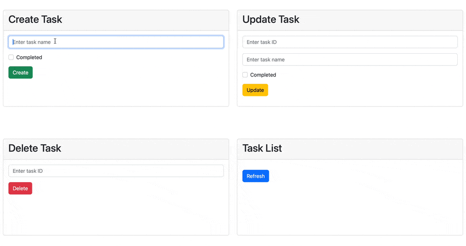

Demo: Django / ajsx

This is simple CRUD django todo application which using ajax for sending request to the server.

You can find using ajax sript on vanilla (clean) JS on this path: `./todo_app/todo_crud_app/templates/todo_crud_app/task_ajax.html`

## Quick start

Clone project and after this use next command

```bash
docker-compose up
```


